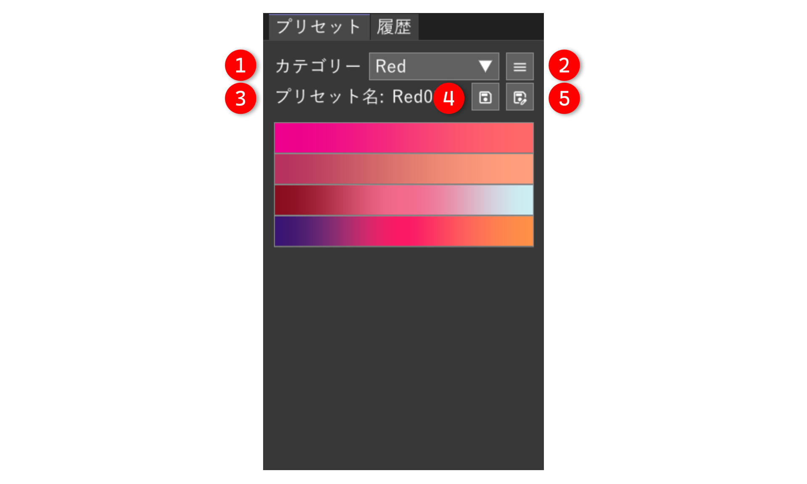
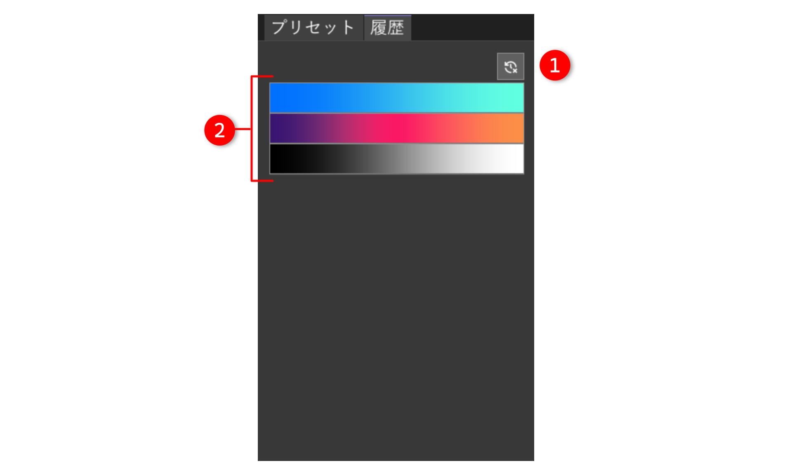

# AviUtl2 Gradient Editor


[](https://github.com/azurite581/AviUtl2-GradientEditor/releases/latest)


[AviUtl2](https://spring-fragrance.mints.ne.jp/aviutl/) 用のグラデーションエディタプラグインです。付属する以下のスクリプトを編集することができます。

- 多色グラデーション（`MutliGradient@GradientEditor`）
- グラデーションマップ（`GradientMap@GradientEditor`）

## 動作環境

[AviUtl ExEdit2](https://spring-fragrance.mints.ne.jp/aviutl/)

- `beta36` 以降必須（`beta39` で動作確認済み）。

## インストール

次のいずれかの方法でインストールできます。

### AviUtl2 カタログを使う（推奨）

本プラグインは [aviutl2-catalog](https://github.com/Neosku/aviutl2-catalog) に登録済みです。  
メインメニュー ＞ パッケージ一覧 ＞ 汎用プラグイン ＞ GradientEditor からインストールしてください。

### 手動インストール

[Releases](https://github.com/azurite581/AviUtl2-GradientEditor/releases/latest) から `GradientEditor_v{version}.au2pkg.zip` をダウンロードし、AviUtl2 のプレビューにドラッグ&ドロップしてください。

以下のファイルがインストールされます。

| ファイル名 | 場所 | 説明 |
| :--- | :--- | :--- |
| `GradientEditor.aux2` | `Plugin` | グラデーションエディタ |
| `@GradientEditor.anm2` | `Script` | 多色グラデーション、グラデーションマップを含むスクリプト |
| `English.GradientEditor.aul2` | `Language` | 翻訳ファイル（英語） |
| `简体中文.GradientEditor.aul2` | `Language` | 翻訳ファイル（簡体字中国語） |
| `GradientEditor.ini` | `Plugin` | レイアウトを保存する設定ファイル。終了時に書き込まれます。 |
| `gradient_editor_default_preset.json` | `Plugin/GradientEditor` | デフォルトプリセットファイル。プリセットファイル（`gradient_editor_preset.json`）が存在しない場合に使用されます。 |

> [!IMPORTANT]
> 0.3.0 以前では `aviutl2.exe` と同階層のフォルダに `imgui.ini` が生成されていました。そのままでも特に影響はありませんが、不要であれば手動で削除してください。

> [!IMPORTANT]
> 0.4.0 にてデフォルトプリセットを多数追加しました。ただし、導入時に `Plugin/GradientEditor` 下に `gradient_editor_preset.json` がすでに存在する場合は、既存のプリセットが優先されるためデフォルトプリセットは読み込まれません。  
デフォルトプリセットを読み込みたい場合は、既存のプリセットファイルを一度削除する必要があります。またデフォルトプリセットを読み込みつつ、既存のプリセットを引き継ぎたい場合は、`gradient_editor_preset.json` の内容を手動でコピーして一時的に保存しておき、デフォルトプリセットが読み込まれた後にプリセットファイルに貼り付ける必要があります。  
プリセットファイルの詳細は[プリセットファイルの形式について](#プリセットファイルの形式について)をご確認ください。

## 付属するスクリプト

本プラグインには以下のスクリプトを含むスクリプトが付属しています。

- 多色グラデーション（`MutliGradient@GradientEditor`）
- グラデーションマップ（`GradientMap@GradientEditor`）

グラデーションエディタ（`GradientEditor.aux2`）自体はこれら 2 つのスクリプトを直感的に操作するためのエディタに過ぎず、単体でグラデーション加工を施すことはできません。基本的には上記のスクリプトをオブジェクトに適用し、そのスクリプトのパラメータをグラデーションエディタ上で編集することになります。

>[!NOTE]
スクリプト単体でも使うことはできますが、グラデーションエディタ上で編集することを前提とした作りになっているため推奨しません。

### 多色グラデーション（`MutliGradient@GradientEditor`）


2色以上のグラデーションを作成するスクリプトです。デフォルトでは `色調整` カテゴリの中にあります。

#### パラメーター

- `強さ`  
グラデーションの適用度
- `中心X`、`中心Y`  
グラデーションの中心位置
- `角度`  
グラデーションの角度
- `幅`  
グラデーションの幅  
標準スクリプトのグラデーションとは異なり、`形状` が `線形` の場合、幅はオブジェクトサイズに合うように調整されません。本スクリプトにおいて、標準スクリプトのグラデーションの `線形` の `幅` に当たる項目は「`ぼかし幅`」になります。
- `背景透明度`  
背景の透明度
- `形状`  
グラデーションマップの形状  
`線形`、`円形`、`矩形`、`凸形`、`円形ループ`、`矩形ループ`、`凸形ループ` から選択できます。
- `合成モード`  
グラデーションの合成モード
- `幅をオブジェクトに合わせる`  
`幅` がオブジェクトにフィットするように調整します（`幅` をオブジェクトの幅と同じサイズにします）。`形状` が `線形`、`凸形` の場合は回転も考慮します。ループ形状の場合は無効です。
- [`共通パラメーター`](#共通パラメーター)

### グラデーションマップ（`GradientMap@GradientEditor`）


Image by <a href="https://pixabay.com/users/pavanprasad_ind-22614562/?utm_source=link-attribution&utm_medium=referral&utm_campaign=image&utm_content=9076520">Pavan Prasad</a> from <a href="https://pixabay.com//?utm_source=link-attribution&utm_medium=referral&utm_campaign=image&utm_content=9076520">Pixabay</a>

グラデーションマップを適用するスクリプトです。デフォルトでは `色調整` カテゴリの中にあります。

#### パラメーター

- `強さ`  
グラデーションマップの適用度
- `背景透明度`  
背景の透明度
- `ルーマ`  
[ルーマ](https://ja.wikipedia.org/wiki/%E3%83%AB%E3%83%BC%E3%83%9E)の係数   
`Rec. 601` と `Rec. 701` のどちらか指定できます。
- `シフト`  
マップのシフト値
- `境界モード`  
マップの範囲外のモード  
`境界色`、`ループ`、`ミラー` から指定できます。
- `合成モード`  
グラデーションの合成モード
- [`共通パラメーター`](#共通パラメーター)

### 共通パラメーター

次の項目はグラデーションエディタ側から編集することを想定しています。両方のスクリプトに存在する項目で、デフォルトでは折りたたまれています。

- `色1` ～ `色30`  
各マーカーの色
- `透明度1` ～ `透明度30`  
各マーカーの透明度
- `位置1` ～ `位置30`  
各マーカーの位置
- `中間点1` ～ `中間点29`  
各マーカー間の中間点の比率
- `ぼかし幅`  
グラデーションのぼかし幅
- `色空間`  
グラデーションの色空間
- `補間経路`  
`HSV`、`HSL`、`LCh`、`Oklch` といった色相を角度として表す色空間が、色相環上でどのような経路で補間するか指定します。
- `マーカー数`  
マーカーの数

## 使い方

### 基本操作

#### 1. スクリプトの適用

`MutliGradient@GradientEditor`、 `GradientMap@GradientEditor`のどちらかをオブジェクトに適用します。

#### 2. グラデーションエディタ上で編集したいスクリプトの選択

1 で適用したスクリプトと同名のスクリプトを、グラデーションエディタの[`対象（スクリプト）`](#-対象スクリプト名)から選択します。

#### 3-A. グラデーションエディタの内容をスクリプトに反映する

オブジェクトを選択した状態でグラデーションエディタの [`反映`](#-反映)を押すことで、スクリプト側に値が反映されます。  
`反映` ボタンが押されている状態であれば、エディタ上の変更が即座にスクリプトに反映されます。

#### 3-B. スクリプトの内容をグラデーションエディタに反映させる

[`読込`](#-読込)を押すことでスクリプトの内容をグラデーションエディタに反映させることができます。`反映` ボタンとは違い、常にスクリプト側から値を取得することはできません。

### 基本設定


#### ① セクション

編集対象とするセクションを指定します。

#### ② 対象（スクリプト名）

編集対象とするスクリプトを名前で指定します。

#### ③ 対象（スクリプトのインデックス）

② で指定したスクリプトが複数ある場合、どのスクリプトを編集対象とするかをインデックス（上から 0, 1, 2 ...）で指定します。

#### ④ 反映

グラデーションエディタの値をスクリプトに反映します。

#### ⑤ 読込

スクリプトの値をグラデーションエディタに読み込みます。

#### ⑥ 選択オブジェクトの再読み込み

選択しているオブジェクトを再読み込みします。

### オプション操作

#### 選択中のオブジェクトを変更した際、新たに選択したオブジェクトを対象にする

選択中のオブジェクトを変更した場合、グラデーションエディタの値をスクリプトに反映させる場合は、再度 `反映` を ON にするか、`反映` が ON の状態のまま[`選択オブジェクトの再読み込み`](#-選択オブジェクトの再読み込み)を押してください。  
スクリプトの値をグラデーションエディタ側に反映させる場合は、`読込` を押してください。

#### 同じスクリプトが 1 つのオブジェクトに複数適用されている場合に、特定のスクリプトを編集対象にする

1 つのオブジェクトに同じスクリプトが複数ある場合、どのスクリプトを編集対象とするかを [`対象（スクリプトのインデックス）`](#-対象スクリプトのインデックス)にて、番号（上から 0, 1, 2 ...）で指定できます。  
例えば上から 2 番目のスクリプトにグラデーションエディタの値を反映させたい場合は 1 に設定します。

#### セクションを指定する

グラデーションエディタで編集できるパラメータのうち、以下のものは移動方法を選択することアニメーションを付けることができます。

- `位置`
- `中間点`
- `透明度`
- `ぼかし幅`

移動後のパラメーターをグラデーションエディタから編集したい場合は、[`セクション`](#-セクション)の線を移動後のセクションに合わせてください。  
中間点を追加した場合は、選択オブジェクトの再読み込みボタンを押すことでセクションの区切り線が出現します。

### マーカーの操作


#### マーカーの追加

グラデーションエディタの下部をクリックすると新たにマーカーを追加できます。最大で 30 個まで追加できます。

#### ① リセット

グラデーションをリセットして初期値に戻します。

#### ② マーカーを等間隔に配置

マーカーのみ等間隔に配置します。

#### ③ マーカーと中間点を等間隔に配置

マーカーと中間点を等間隔に配置します。

#### ④ すべての中間点を中央に再配置

すべての中間点を各区間の中央（`50`）に再配置します。

#### ⑤ マーカーを反転

マーカーの位置を左右反転します。

#### ⑥ マーカーの削除

削除したいマーカーを選択した状態で、ツールボタンの削除ボタンを押すと削除できます。マーカーが 2 つしかない場合は削除できません。

#### ⑦ マーカーの色の変更

マーカーをダブルクリックしてカラーエディタを表示するか、色を変更したいマーカーを選択した状態で、設定項目の [`色`](#色) からカラーエディタを開くことで変更することができます。

### 設定項目


グラデーションの下にある設定項目から、各値を数値で指定することができます。
トラックバーに対しては `Ctrl + 左クリック` することで数値が入力できるようになります。

#### 色

選択中のマーカーの色を変更します。数値の横の色付きのボタンを押すとカラーエディタが表示されます。  
数値上で右クリックすると、色の表示形式を変更できます。

#### 位置

選択中のマーカーの位置を変更します。

#### 中間点

選択中の中間点の比率を変更します。

#### ぼかし幅

グラデーションのぼかし幅を変更します。

#### 色空間

グラデーションの色空間を指定できます。

#### 補間経路

`HSV`、`HSL`、`LCh`、`Oklch` といった色相を角度として表す色空間が、色相環上でどのような経路で補間するか指定します。

### プリセットの使用



メニューバーの `表示` メニューから `プリセット` を選択すると、プリセットタブが表示されます（デフォルトで表示されています）。

プリセットをクリックすると、グラデーションエディタ上のグラデーションがプリセットのものに置き換わります。

#### ① カテゴリー

表示するカテゴリーを切り替えます。

#### ② カテゴリーの編集

カテゴリーの右隣のメニューボタンを押すと、カテゴリーを編集するためのポップアップウィンドウが表示されます。ポップアップウィンドウでは以下の操作を行うことができます。

- **カテゴリーの並び替え**  
  カテゴリーをドラッグ&ドロップすることで任意の順に並べ替えることができます。

- **カテゴリー名の変更**  
  カテゴリー上で右クリック ＞ `名前を変更` から任意の名前に変更できます。

- **プリセットをまとめて移動**  
  カテゴリー上で右クリック ＞ `プリセットをまとめて移動` から、右クリックしたカテゴリーに属する全てのプリセットを別のカテゴリにまとめて移動できます。

- **削除**  
  カテゴリーのみ削除するか、カテゴリーに属するプリセットごと削除するか選択できます。  
  カテゴリーのみ削除した場合、そのカテゴリーに属していたプリセットは `Uncategorized`（未分類）というカテゴリーに移動します。

#### ③ プリセット名

選択しているプリセット名が表示されます。起動時は何も選択していない状態になっています。

#### ④ 新規保存

現在のグラデーションを新規プリセットとして保存します。すでに同じ名前のプリセットが存在する場合は保存できません。  
プリセットは `Plugin/GradientEditorPreset` フォルダ下の `gradient_editor_preset.json` に書き込まれます。

#### ⑤ 上書き保存

現在選択中のプリセットをグラデーションエディタのグラデーションで上書きします。

#### プリセットの入れ替え

プリセットをドラッグ&ドロップすることで順番を入れ替えることができます。

#### プリセットの削除

プリセット上で右クリックし、`削除` を押してください。

#### カテゴリーの変更

プリセット上で右クリックし、`カテゴリーを変更` メニューを押し、移動先となるカテゴリー名をクリックしてください。  
このとき、カテゴリー検索欄に名前を入力し、`+` マークの付いたカテゴリー名をクリックすることで、カテゴリーの作成とプリセットを移動を同時に行うことができます。

### プリセットファイルの形式について

プリセットは `gradient_editor_preset.json` に以下の形式で保存されます。

```json
{
    "categories": [...],
    "presets": [...]
}
```

- `categories`：`array<string>`  
  カテゴリー名の配列
- `presets`：`array<プリセット>`  
  [プリセット](#プリセット)の配列

#### プリセット

```json
{
    "category": "CategoryName",
    "name": "PresetName",
    "colors": [...],
    "positions": [...],
    "midpoints": [...],
    "blur_width": 1.0,
    "color_space": 0,
    "interpolation_path": 0
}
```

- `category` : `string`  
  プリセットのカテゴリー名
- `name` : `string`  
  プリセット名
- `colors` : `array<string>`  
色の配列（`0xRRGGBBAA` 形式）
- `positions` : `array<number>`  
各色の位置（0.0〜1.0）
- `midpoints` : `array<number>`  
各色の中間点（0.0〜1.0）
- `blur_width` : `number`  
ぼかし幅（0.0～1.0）
- `color_space` : `number`  
色空間の種類
- `interpolation_path` : `number`  
補間方法

例）

```json
{
    "categories": [
        "Basic"
    ],
    "presets": [
        {
            "category": "Basic",
            "name": "Basic01",
            "colors": [
                "0x000000FF",
                "0xFFFFFFFF"
            ],
            "positions": [
                0.0,
                1.0
            ],
            "midpoints": [
                0.5
            ],
            "blur_width": 1.0,
            "color_space": 0,
            "interpolation_path": 0
        }
    ]
}
```

### 履歴



メニューバーの `表示` メニューから `履歴` を選択すると、履歴タブが表示されます（デフォルトで表示されています）。

履歴タブはプリセットのクリック、またはスクリプトからのグラデーションの読み込み操作でグラデーションが丸ごと置換された際に、置換前のグラデーションを履歴として保存します。  
履歴は[プリセットの形式](#プリセット)からカテゴリー名を抜き、名前を置換時の時刻に変更した形式で `Plugin/GradientEditorPreset` 下の `gradient_editor_history.json` に書き込まれます。

#### ① 履歴の削除

すべての履歴を削除します。

#### ② 履歴

履歴は最大で 50 件まで保存され、古いものから順に置き換えられます。  
各履歴をクリックすることでグラデーションが置き換わります（※履歴による置換では、置換前のグラデーションは履歴に保存されません）。

### その他

- ウィンドウの配置メニューはタイトルバー上で右クリックすることで表示できます。

- 起動時にグラデーションエディタ上に表示されるグラデーションは、前回終了時に表示されていたグラデーションになります。

- 起動時にプリセットタブに表示されるプリセットは、プリセットファイルの `categories` 配列で一番上にあるカテゴリーのプリセットになります。

- プリセットファイル（`gradient_editor_preset.json`）を削除した場合、起動後にプリセットファイルが自動的に生成されます。生成時に使用される値はデフォルトプリセットファイル（`gradient_editor_default_preset.json`）に記述されているものになります。

## ビルド

### 環境

- **Windows 11**
- **CMake** 3.31 以上
- **MSVC 2022**
- **Git**
- **[aulua](https://github.com/karoterra/aviutl2-aulua)**
- **[aviutl2-cli](https://github.com/sevenc-nanashi/aviutl2-cli)**

本リポジトリをクローン後、`aviutl2.tmol` と同じ階層で

```shell
au2 prepare
au2 release
```

とすると、 `release` に `GradientEditor-v{version}.au2pkg.zip` が生成されます。

開発用にビルドする場合は

```shell
au2 develop  # または au2 dev
```

とすることで開発用の AviUtl2 が `.aviutl2-cli/development` にダウンロードされ、その中に各ファイルが配置されます。

各コマンドの詳細については [aviutl2-cli](https://github.com/sevenc-nanashi/aviutl2-cli) を参照してください。

## ライセンス

[MIT License](LICENSE.txt) に基づくものとします。

## クレジット

### 使用したサードパーティライブラリ

[ThirdPartyNotices](ThirdPartyNotices.md) を参照してください。

### 使用したツール

### [aulua](https://github.com/karoterra/aviutl2-aulua)

<details>
<summary>MIT License</summary>

```text
MIT License

Copyright (c) 2025 karoterra

Permission is hereby granted, free of charge, to any person obtaining a copy
of this software and associated documentation files (the "Software"), to deal
in the Software without restriction, including without limitation the rights
to use, copy, modify, merge, publish, distribute, sublicense, and/or sell
copies of the Software, and to permit persons to whom the Software is
furnished to do so, subject to the following conditions:

The above copyright notice and this permission notice shall be included in all
copies or substantial portions of the Software.

THE SOFTWARE IS PROVIDED "AS IS", WITHOUT WARRANTY OF ANY KIND, EXPRESS OR
IMPLIED, INCLUDING BUT NOT LIMITED TO THE WARRANTIES OF MERCHANTABILITY,
FITNESS FOR A PARTICULAR PURPOSE AND NONINFRINGEMENT. IN NO EVENT SHALL THE
AUTHORS OR COPYRIGHT HOLDERS BE LIABLE FOR ANY CLAIM, DAMAGES OR OTHER
LIABILITY, WHETHER IN AN ACTION OF CONTRACT, TORT OR OTHERWISE, ARISING FROM,
OUT OF OR IN CONNECTION WITH THE SOFTWARE OR THE USE OR OTHER DEALINGS IN THE
SOFTWARE.
```

</details>

### [aviutl2-cli](https://github.com/sevenc-nanashi/aviutl2-cli)

<details>
<summary>MIT License</summary>

```text
MIT License

Copyright (c) 2026 Nanashi. <sevenc7c.com>

Permission is hereby granted, free of charge, to any person obtaining a copy
of this software and associated documentation files (the "Software"), to deal
in the Software without restriction, including without limitation the rights
to use, copy, modify, merge, publish, distribute, sublicense, and/or sell
copies of the Software, and to permit persons to whom the Software is
furnished to do so, subject to the following conditions:

The above copyright notice and this permission notice shall be included in all
copies or substantial portions of the Software.

THE SOFTWARE IS PROVIDED "AS IS", WITHOUT WARRANTY OF ANY KIND, EXPRESS OR
IMPLIED, INCLUDING BUT NOT LIMITED TO THE WARRANTIES OF MERCHANTABILITY,
FITNESS FOR A PARTICULAR PURPOSE AND NONINFRINGEMENT. IN NO EVENT SHALL THE
AUTHORS OR COPYRIGHT HOLDERS BE LIABLE FOR ANY CLAIM, DAMAGES OR OTHER
LIABILITY, WHETHER IN AN ACTION OF CONTRACT, TORT OR OTHERWISE, ARISING FROM,
OUT OF OR IN CONNECTION WITH THE SOFTWARE OR THE USE OR OTHER DEALINGS IN THE
SOFTWARE.
```

</details>

## 更新履歴

[CHANGELOG](CHANGELOG.md) を参照してください。
