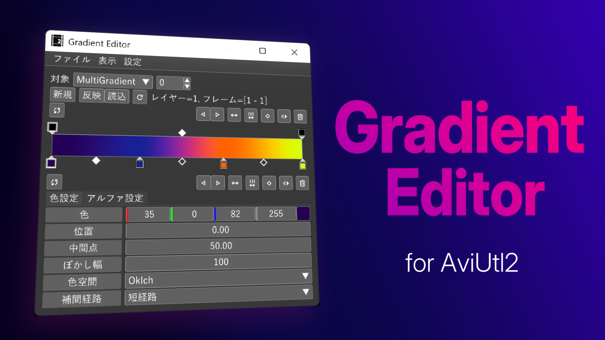
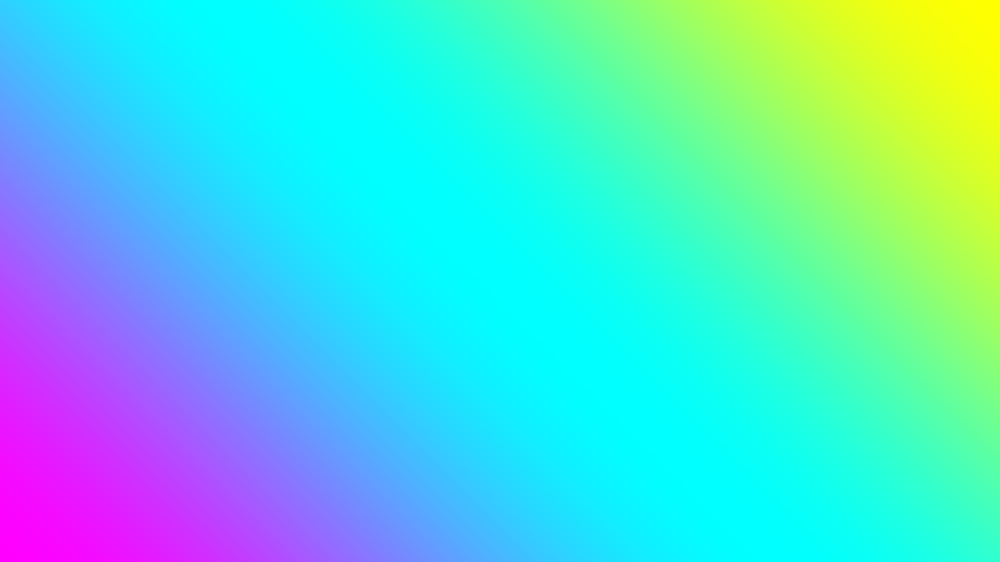

<h1 align="center">AviUtl2 Gradient Editor</h1>

<p align="center">
  
  <a href="https://github.com/azurite581/AviUtl2-GradientEditor/releases/latest" style="text-decoration: none;">
    
  </a>
  <a href="https://github.com/azurite581/AviUtl2-GradientEditor/releases/latest" style="text-decoration: none;">
    
  </a>
  
</p>

<p align="center"><a href="https://spring-fragrance.mints.ne.jp/aviutl/">AviUtl2</a> 用のグラデーションエディタープラグイン</p>



## はじめに

各説明の詳細は [Wiki](https://github.com/azurite581/AviUtl2-GradientEditor/wiki) を参照してください。

## 動作環境

[AviUtl ExEdit2](https://spring-fragrance.mints.ne.jp/aviutl/)

- `beta36` 以降必須（`beta49` で動作確認済み）。

## インストール

次のいずれかの方法でインストールできます。

### AviUtl2 カタログを使う（推奨）

本プラグインは [aviutl2-catalog](https://github.com/Neosku/aviutl2-catalog) に登録済みです。  
メインメニュー ➡️ パッケージ一覧 ➡️ 汎用プラグイン ➡️ Gradient Editor からインストールしてください。

### 手動インストール

[Releases](https://github.com/azurite581/AviUtl2-GradientEditor/releases/latest) から `GradientEditor_v{version}.au2pkg.zip` をダウンロードし、AviUtl2 のプレビューにドラッグ&ドロップしてください。

> [!NOTE]
> ### For non-Japanese speaking users
> Please download the translation files from [here](https://github.com/azurite581/aviutl2_translations_azurite/releases/latest).

[🔗詳細](https://github.com/azurite581/AviUtl2-GradientEditor/wiki/インストール)

## 付属するスクリプトについて

本プラグインには以下のスクリプトが付属しています。

- 多色グラデーション（`MutliGradient@GradientEditor`）
- グラデーションマップ（`GradientMap@GradientEditor`）

グラデーションエディター（`GradientEditor.aux2`）自体はこれらを直感的に操作するためのエディタに過ぎず、プラグイン単体でグラデーション加工を施すことはできません。基本的には上記のスクリプトをオブジェクトに適用し、そのスクリプトのパラメータをグラデーションエディタ上で編集することになります。

>[!NOTE]
スクリプト単体でも使うことはできますが、グラデーションエディタ上で編集することを前提とした作りになっているため推奨しません。

### 多色グラデーション



2色以上のグラデーションを作成するスクリプトです。デフォルトでは `色調整` カテゴリの中にあります。

[🔗詳細](https://github.com/azurite581/AviUtl2-GradientEditor/wiki/多色グラデーション)

### グラデーションマップ

<table>
  <tr>
    <td><br>適用前</td>
    <td><br>適用後</td>
  </tr>
</table>

Image by <a href="https://pixabay.com/users/wj_y2017fufu-41862272/?utm_source=link-attribution&utm_medium=referral&utm_campaign=image&utm_content=10139490">WJ Y</a> from <a href="https://pixabay.com//?utm_source=link-attribution&utm_medium=referral&utm_campaign=image&utm_content=10139490">Pixabay</a>

グラデーションマップを適用するスクリプトです。デフォルトでは `色調整` カテゴリの中にあります。

[🔗詳細](https://github.com/azurite581/AviUtl2-GradientEditor/wiki/グラデーションマップ)

## 使い方

1. **スクリプトの選択**  
オブジェクトに適用したいスクリプトをプラグインの `対象` コンボボックスから選択します。

2. **スクリプトの追加**  
オブジェクトを選択した状態で `反映` ボタンを押すと、1 で指定したスクリプトがオブジェクトに追加されます。すでに同じスクリプトが追加されている場合は追加されません。

3. **グラデーションの反映**  
`反映` ボタンが押されている状態でプラグインのグラデーションを編集すると、スクリプト側に変更が反映されます。

[🔗詳細（使い方）](https://github.com/azurite581/AviUtl2-GradientEditor/wiki/使い方)  
[🔗詳細（グラデーションエディターの説明）](https://github.com/azurite581/AviUtl2-GradientEditor/wiki/グラデーションエディター)

## ライセンス

[MIT License](LICENSE.txt) に基づくものとします。

## クレジット

### 使用したサードパーティライブラリ

[ThirdPartyNotices](ThirdPartyNotices.md) を参照してください。

### 使用したツール

### [aulua](https://github.com/karoterra/aviutl2-aulua)

<details>
<summary>MIT License</summary>

```text
MIT License

Copyright (c) 2025 karoterra

Permission is hereby granted, free of charge, to any person obtaining a copy
of this software and associated documentation files (the "Software"), to deal
in the Software without restriction, including without limitation the rights
to use, copy, modify, merge, publish, distribute, sublicense, and/or sell
copies of the Software, and to permit persons to whom the Software is
furnished to do so, subject to the following conditions:

The above copyright notice and this permission notice shall be included in all
copies or substantial portions of the Software.

THE SOFTWARE IS PROVIDED "AS IS", WITHOUT WARRANTY OF ANY KIND, EXPRESS OR
IMPLIED, INCLUDING BUT NOT LIMITED TO THE WARRANTIES OF MERCHANTABILITY,
FITNESS FOR A PARTICULAR PURPOSE AND NONINFRINGEMENT. IN NO EVENT SHALL THE
AUTHORS OR COPYRIGHT HOLDERS BE LIABLE FOR ANY CLAIM, DAMAGES OR OTHER
LIABILITY, WHETHER IN AN ACTION OF CONTRACT, TORT OR OTHERWISE, ARISING FROM,
OUT OF OR IN CONNECTION WITH THE SOFTWARE OR THE USE OR OTHER DEALINGS IN THE
SOFTWARE.
```

</details>

### [aviutl2-cli](https://github.com/sevenc-nanashi/aviutl2-cli)

<details>
<summary>MIT License</summary>

```text
MIT License

Copyright (c) 2026 Nanashi. <sevenc7c.com>

Permission is hereby granted, free of charge, to any person obtaining a copy
of this software and associated documentation files (the "Software"), to deal
in the Software without restriction, including without limitation the rights
to use, copy, modify, merge, publish, distribute, sublicense, and/or sell
copies of the Software, and to permit persons to whom the Software is
furnished to do so, subject to the following conditions:

The above copyright notice and this permission notice shall be included in all
copies or substantial portions of the Software.

THE SOFTWARE IS PROVIDED "AS IS", WITHOUT WARRANTY OF ANY KIND, EXPRESS OR
IMPLIED, INCLUDING BUT NOT LIMITED TO THE WARRANTIES OF MERCHANTABILITY,
FITNESS FOR A PARTICULAR PURPOSE AND NONINFRINGEMENT. IN NO EVENT SHALL THE
AUTHORS OR COPYRIGHT HOLDERS BE LIABLE FOR ANY CLAIM, DAMAGES OR OTHER
LIABILITY, WHETHER IN AN ACTION OF CONTRACT, TORT OR OTHERWISE, ARISING FROM,
OUT OF OR IN CONNECTION WITH THE SOFTWARE OR THE USE OR OTHER DEALINGS IN THE
SOFTWARE.
```

</details>

## 更新履歴

[CHANGELOG](CHANGELOG.md) を参照してください。
